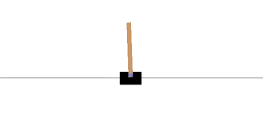
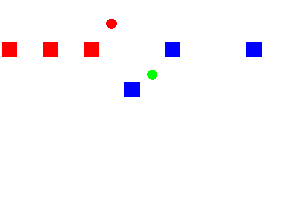

# Traffic Simulator

Make your own traffic simulator in python and use reinforcement learning to optimize the flow of vehicles! 

The objective is to formulate traffic control as a reinforcement learning problem, and implement a traffic simulator that an algorithm we provide can then solve. You can use this to explore the advantages and disadvantages of RL, and consider the challenges in deploying this technology in the real world. 

# Contents of this repo

We provide an implementation of the Deep Q Networks algorithm [1] in the algorithm folder, which you shouldn't really have to modify. We also provide two examples of RL environments in the environments folder: the classic control task Cartpole [2] and a very basic implementation of traffic simulation, with cars approaching a single traffic-light controlled intersection. We also provide a blank template for you to create your own simulation: the trafficsim.py file in the environments folder.

Note that our traffic simulator demonstrates one way in which traffic can be represented as an RL problem; however, we encourage you to find alternative formulations.

We have also included a a short and simple introduction to reinforcement learning in pdf format, which includes a brief explanation of how the DQN algorithm works. This introduction also contains links to more advanced resources if you wish to learn more.

# Installation

Python 3 is required. Clone the repo and install the requirements with:

```sh
pip install -r requirements.txt
```

We recommend using a virtual environment for this, see [virtualenv](https://docs.python-guide.org/dev/virtualenvs/).

# Running the algorithms

The experiments folder contains scripts to train and test RL agents on Cartpole and on our simple traffic simulator. To train an agent on Cartpole, simply run the following command from the trafficsolver folder:

```sh
python -m experiments.train_cartpole.py
```

This takes about 30 seconds. To watch the performance of a trained agent, run:

```sh
python -m experiments.enjoy_cartpole.py
```

# Description of the RL environments provided as examples

Cartpole: A pole stands upright on a cart that can move left or right. The agent has to keep the pole upright against gravity for as long as possible. The agent gets 1 point for every time step the cart is upright, up to 200 time steps. The episode ends if the pole is at too much of an angle or if the cart has left the edges of the screen.



Basic Traffic Simulator: At a T-junction controlled by two traffic lights, red cars arrive from the left and blue cars from the bottom. At each time step, the cars move forward and the agent changes the state of one of the traffic lights. The agent gains one point each time a car exits the screen to the right. The episode terminates either after 50 time steps or if a crash happens at the intersection.



Note: the RL algorithm provided perfectly solves Cartpole but often finds sub-optimal strategies for the traffic simulator. Some reasons for this are:

1) Our implementation does not allow the agent to do nothing. At each step it must switch the state of a traffic light.

2) Our implementation only gives the following limited information to the agent's neural network: whether there is a red car just before the left light, whether there is a blue car just below the bottom light, and the state of the two traffic lights. The DQN algorithm we use relies on being able to predict what reward the agent will get from its actions, however we only give rewards when cars leave the screen to the right. With incomplete information for making this prediction, the agent struggles to learn.

# Some suggestions

To explore how RL can be used to optimize traffic flows, some possible courses of action are:

1) Improve our simple environment by fixing the issues mentioned above.

2) Build more complex systems with different types of traffic, more intersections, or different regimes of traffic flow.

3) Study the limits of our learning algorithm: when does it fail? How could it be improved?

We also encourage original ideas.

# References

1: [Human-Level Control through Deep Reinforcement Learning](http://www.readcube.com/articles/10.1038/nature14236)

2: Our version of Cartpole is a modified version of the environment in [OpenAI Gym](https://gym.openai.com/).
